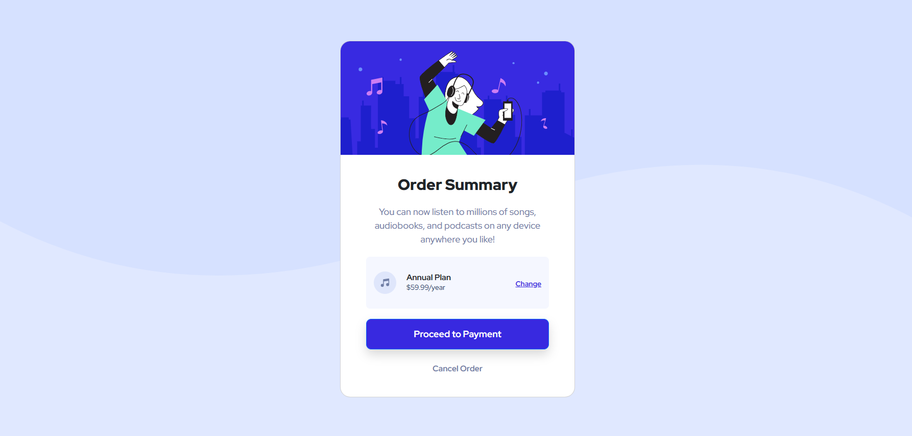
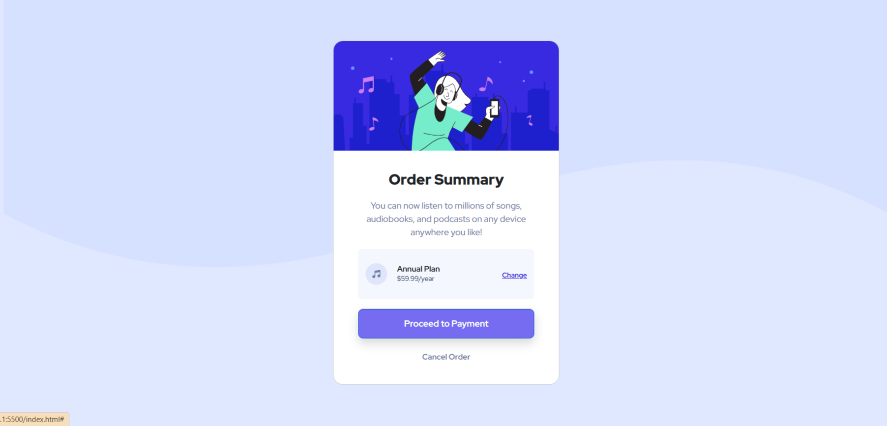
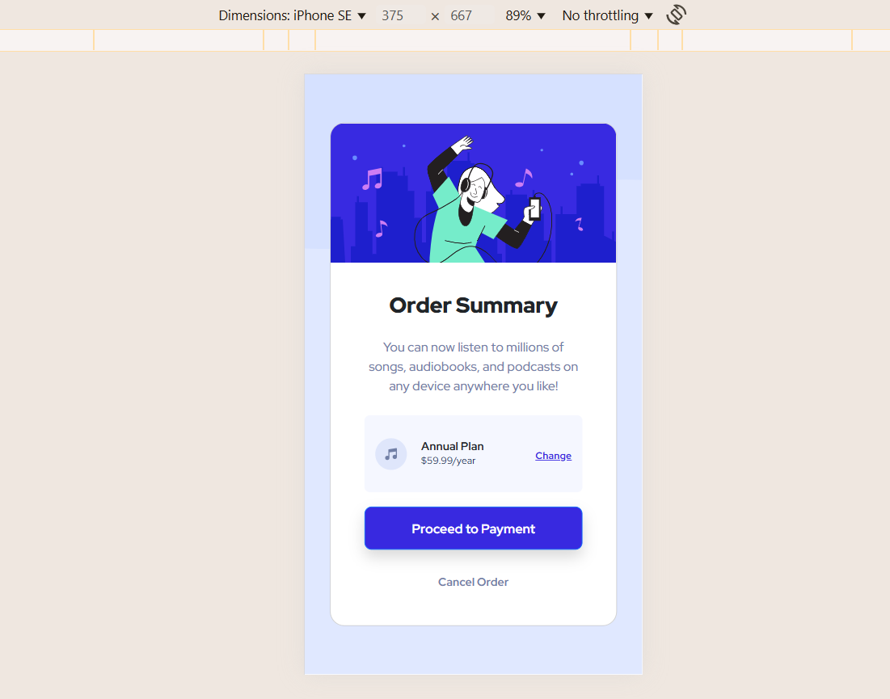

# Frontend Mentor - Order summary card solution

This is a solution to the [Order summary card challenge on Frontend Mentor](https://www.frontendmentor.io/challenges/order-summary-component-QlPmajDUj). Frontend Mentor challenges help you improve your coding skills by building realistic projects.

## Table of contents

- [Overview](#overview)
  - [The challenge](#the-challenge)
  - [Screenshot](#screenshot)
  - [Links](#links)
- [My process](#my-process)
  - [Built with](#built-with)
  - [What I learned](#what-i-learned)
  - [Useful resources](#useful-resources)
- [Author](#author)

## Overview

This is my solution to the Frontend Mentor Order Summary Card challenge.

### The challenge

Users should be able to:

- See hover states for interactive elements

### Screenshot

## 🔍 Desktop Design



## 🖱️ Desktop Hover State



## 📱 Mobile View



### Links

- Solution URL: [My solution](https://github.com/hajarhabib2/Order-summary-card)
- Live Site URL:[Live Site](https://hajarhabib2.github.io/Order-summary-card/)

## My process

1. **Understand the Design**: Analyzed the provided design, focusing on mobile and desktop views.
2. **Set Up the Project**: Created the basic structure with `index.html` and linked custom CSS, using **Bootstrap 5** for layout.
3. **Build the Layout**: Used **Bootstrap's grid** and utility classes to center the card content.
4. **Style the Plan Section**: Applied **flexbox** for aligning icon, title, price, and link within the plan section.
5. **Make It Responsive**: Implemented **media queries** to adapt the layout for different screen sizes.
6. **Add Buttons and Links**: Styled buttons and links with **Bootstrap** and custom hover effects.
7. **Test and Deploy**: Tested across devices and deployed on **GitHub Pages**.

### Built with

- Semantic HTML5 markup
- CSS custom properties
- Flexbox
- CSS Grid
- Mobile-first workflow
- [Bootstrap 5](https://getbootstrap.com/)

### What I learned

- **Responsive Design**: Learned to use **Bootstrap** and **media queries** for a responsive layout.
- **Flexbox**: Used **flexbox** for efficient item alignment.
- **CSS Variables**: Leveraged custom properties (e.g., `--Pale-blue`) for consistent styling.
- **Hover Effects**: Added interactive hover effects to buttons and links.
- **Image Responsiveness**: Used `img-fluid` to make images scale properly.
- **Deployment**: Deployed the project using **GitHub Pages**.

```html
<!-- HTML Button Example -->
<a
  href="#"
  class="btn btn-primary shadow mx-auto d-flex rounded-3 justify-content-center align-items-center"
>
  Proceed to Payment
</a>

### Useful resources - [Bootstrap Documentation](https://getbootstrap.com) -
This was my go-to resource for understanding Bootstrap's grid system, utilities,
and components. It was incredibly helpful for building the responsive layout. -
[Google Fonts](https://fonts.google.com) - This was a great resource for
selecting the perfect font for my project. I used **Red Hat Display** from
Google Fonts to enhance the typography. ## Author - Website - [Hajar
Habib](https://github.com/hajarhabib2)
```
